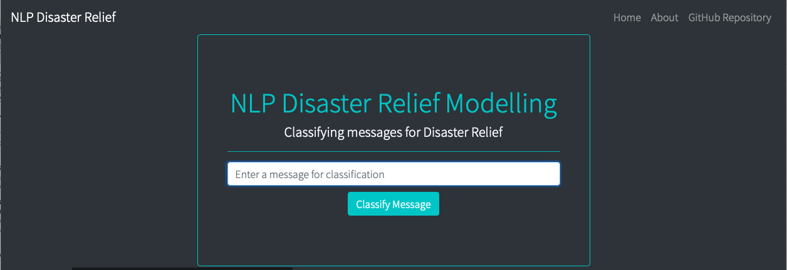

# nlp-disaster-app

## Contents
1. [Overview](1.-Overview)
1. [Getting Started](2.-Getting-Started)
    1. [Dependencies](2.1.-Dependencies)
    1. [Installation](2.2.-Installation)
    1. [Executing Model Scripts](2.3.-Executing-Model-Scripts)
1. [Future Developments](3.-Future-Developments)
1. [Author](4.-Author)
1. [License](5.-License)
1. [Acknowledgements](6.-Acknowledgements)
## 1. Overview
This project was completed as part of the Udacity Data Science Nanodegree program. The application is live at https://limitless-ravine-56809.herokuapp.com/index however instructions have been provided in the following sections if you wish to run the application locally.
#### Business Requirements
To correctly classify messages into disaster and emergency-related categories. 
## 2. Getting Started
The following sections describe how to install the application structure locally.
### 2.1. Dependencies
* Python 3.6+
* Web framework: Flask, gunicorn
* Data Visualization: plotly
* Database: SQLAlchemy
* Data Preparation & Modelling: pandas, NLTK (average_perceptron_tagger, punkt, WordNet), scikit-learn

For a full list of requirements, please see the [requirements.txt](#) file.
### 2.2. Installation
To clone the project, use the following: `git clone https://github.com/dagrewal/nlp-disaster-app.git`

To install the dependencies using pip, make sure that you are in the root directory of the project. You can check this by using the `ls` command in the terminal and ensuring that you can see *requirements.txt*. If you are using Windows, use `dir` in the command prompt. Then use the following: `pip install -r requirements.txt` to install the required dependencies.

Once everything has been installed correctly, again using terminal or command prompt, type `gunicorn nlp-disaster-app:app` and navigate to **localhost:8000** in your web browser.

If you experience any issues during the installation process, please log your issue using the [Issues](https://github.com/dagrewal/nlp-disaster-app/issues) tab in the GitHub project.
### 2.3. Executing Model Scripts
There are two Python files that are used to (a) read in and clean the raw data and store in a SQL database and (b) prepare the data, engineer new features and train a multi-class supervised learning model using a training dataset.

#### Reading In, Cleaning & Storing Data to SQL
Using the terminal (or command prompt):

1. Navigate to `nlp-disaster-app/data`
2. Run `python process_data.py disaster_messages.csv disaster_categories.csv [insert_database_name].db`

The Python script will proceed to read in the two .csv files, clean the data as specified in the *clean_data* function and store the cleaned data into a database that you specified in the arguments above. The database will be saved to the same folder as the Python script.

#### Preparing, Building & Storing A Supervised Learning Model
Using the terminal (or command prompt):

1. Navigate to `nlp-disaster-app/models`
2. Run `python train_classifier.py ../data[insert_database_name].db [insert_saved_model_name]`

The Python script will proceed to prepare the data for training, engineer new features and train a supervised learning model using the prepared training data. The script will save the model into a .pkl file in the same folder as the Python script. For specifics on the engineering of new features and the model development, please inspect the functions within the script.

Once everything has finished running (**note** that the *train_classifier.py* script will take a while to run), navigate to `nlp-disaster-app` and run `gunicorn nlp-disaster-app:app` and navigate to **localhost:8000**.

## 3. Future Developments
The model actually has poor predictive performance. It could be a task for the reader to improve the accuracy of the model by engineering new features and applying different supervised learning models. The reader could also create more visualizations to be included on the home page of the application.

## 4. Author
[Daniel Grewal](https://github.com/dagrewal)

## 5. License
https://opensource.org/licenses/MIT

## 6. Acknowledgements
This project was completed as part of the Udacity Data Science Nanodegree program.
The data used for this project was provided by Figure8.
